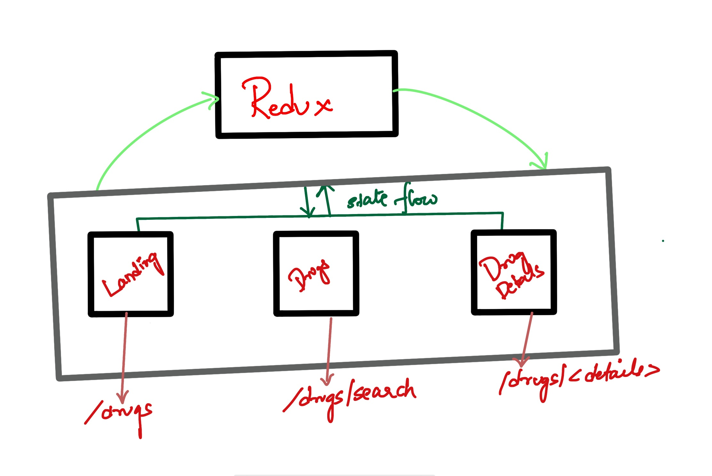
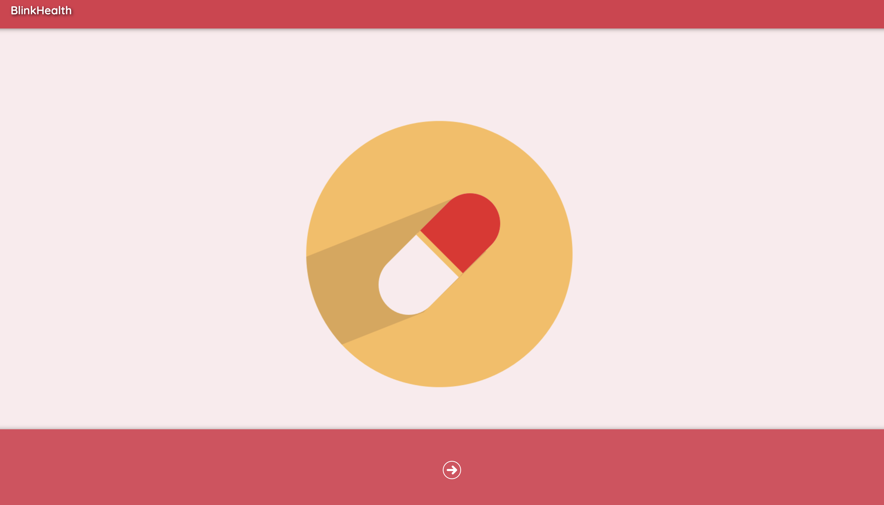
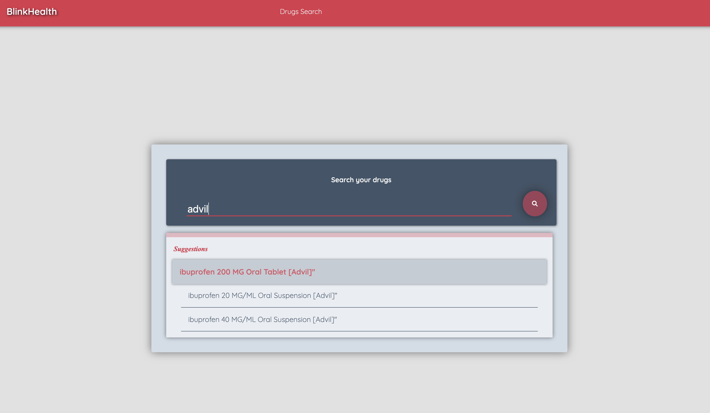
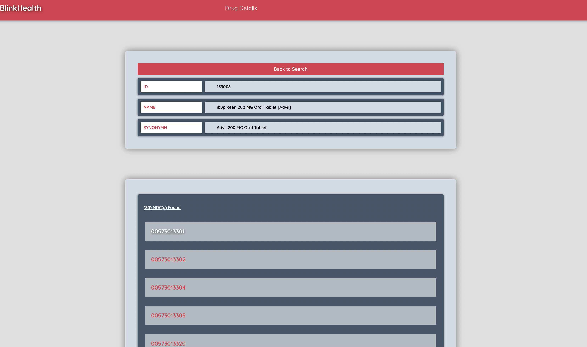
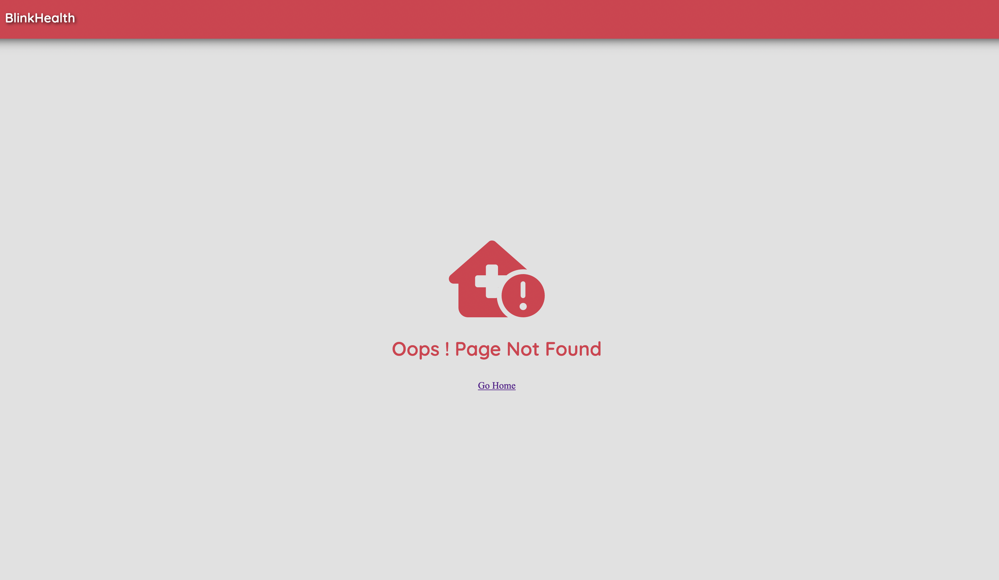

# DESIGN DOCUMENT (ARCHITECTURE)

The application has 3 routes. One main route and 2 child routes.

1. Drugs
    1.a Drugs/search
    1.b Drugs/<path_for_ndc_details>

The application is configured with redux-thunk for the middleware.
It uses 
    redux for the store management
    Immutables for the store management and debugging
    Framer motion for the animations. 
    eslint for linting

> Here is the quick walkthrough on how the app looks on web:

> DESIGN:

    The design is pretty straightforward. All state changes flow through the centralized store (redux).

   

> Here are the images of the pages in the app:

/drugs
 
/drugs/search

/drugs/details

/notfound

NOTE: Installation requirements:
> 1. Node version used : v14.0.0
> 2. NPM Version used:  v6.14.4
> 3. Because the application is coded in Class models, react router integration was not easy, so I had to create a wrapper in the redux connector for the passed in component. 